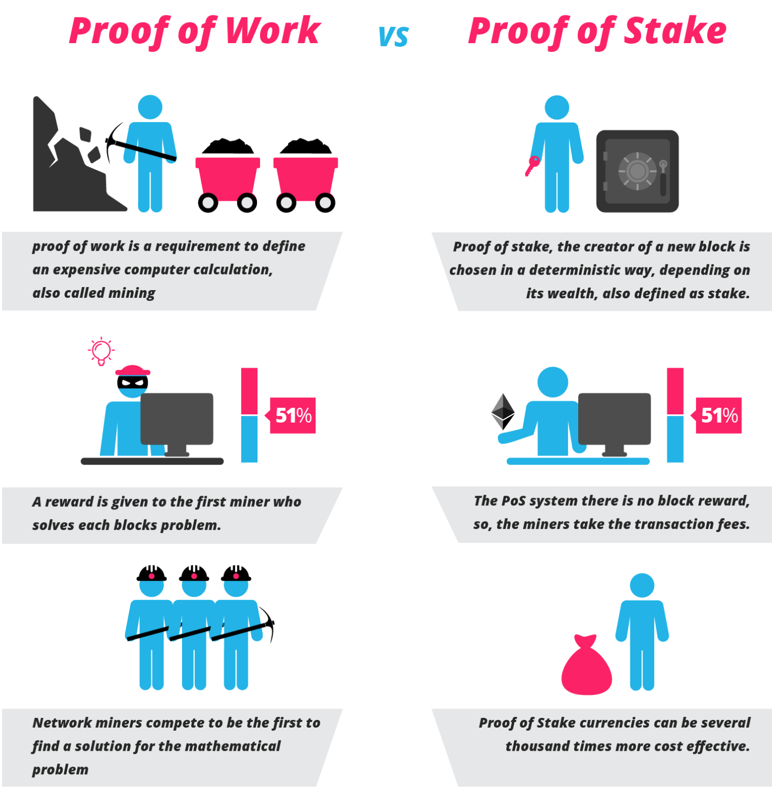

# Learn Node.js And BlockChain With Ebook

## 另外，运行本模块内代码可以实现一个 Node 上的 BlockChain 并实现了挖矿过程哦
访问地址：http://localhost:9090/blockChain

#### 本文介绍一些 Node 可用的基本组件、相关代码，以及一些有关区块链的概念。
相关核心文件包括 `nodeService`，`views/index`，`public/js/theFirstNode.js`等

#### 摘自[亿书](http://bitcoin-on-nodejs.ebookchain.org)

## Part 1. CODING PART

本部分介绍 Node 可用的基本组件、相关代码。

### Node 概述

#### 什么是 Node

> Node.js is a JavaScript runtime built on Chrome's V8 JavaScript engine. Node.js uses an event-driven, non-blocking I/O model that makes it lightweight and efficient.

Node.js 是一个搭建在 Chrome V8 上的 JavaScript 即时运行平台，采用事件驱动、非阻塞I/O模型，既轻量又高效。

#### Node 的优势在哪里：
* 模块化管理项目的能力，允许 js 代码分散在不通过的文件中。
* 也正是因为 js 代码可以分散，第三方包大量涌现，js 有了强大的后备支持。
* 开发完成后，Node 可以帮助开发者对前端代码的 js 或 css 等文件进行合并、压缩、混淆，以及项目部署等。

#### 开发者应该具备的 Node 思维

1、一切都是数据流

**任何流都是时间的函数，为了节省时间、提高效率，最好的方式当然是并行处理。也就是说每一个流使用一个独立的线程，而不影响其他的。事实上，Node.js 就是这么处理的。**

2、事事皆回调

3、异常要捕捉

**Node.js 是单进程(但不是单线程)的应用，异常如果未被正确处理，一旦抛出，就会引起整个进程死掉。**

>这里补充一点，JavaScript 作为浏览器的脚本语言时则是单线程，这也是它的重要特性之一。

而异常多发生在回调函数里，回调非常复杂的时候，异常很难定位。所以，很多人说，Node.js 很快，但很脆弱。

栗子：（错误的）

``` JavaScript
function myApiFunc(callback)
{
    /*
     * 这种模式并不工作
     */
    try {
      doSomeAsynchronousOperation(function (err) { //异步的原因，这里的回调函数被放在另一个线程独立工作，并不在try/catch下工作
        if (err)
          throw (err);
        /* continue as normal */
      });
    } catch (ex) {
      callback(ex);
    }
}
```

正确的方法：
Node.js 提供了3种基本的传递模式，分别是 Throw， Callback，以及 EventEmitter。


### 安装使用CNpm：
使用淘宝npm镜像，可以提高我们的组件下载数度

```
npm install -g cnpm --registry=https://registry.npm.taobao.org
```

### 安装前端管理工具 bower：

```
cnpm install -g bower 
```

当然也可以使用 npm install * 命令，二者一样，只不过cnpm使用淘宝镜像，在中国安装会快些

bower 是一个 npm 包，它专门用来管理 web 前端（包含js,css,images,fonts等）依赖包。我们可以简单类比，bower 用于管理前端包，npm 管理后台库（包）。

### d3.js

```
bower install d3 --save
```

选项 --save 将在 bower.json 文件里，写入下面的信息：
```
"dependencies": {
  ...
  "d3": "^4.13.0"
  ...
}
```

于是，在另一台电脑开发时，克隆完代码，就可以直接运行下面的命令，**自动安装**全部依赖的第三方组件了

```
bower intall
```

和 npm 很像啊是不是～

d3.js 是**数据可视化**非常出名的前端开发包，提供前端可显示的柱状图、饼状图等。

### gulp

```
cnpm install gulp --global
# Then
cnpm install gulp --save-dev
```

所以，gulp 是干嘛的？（还有类似的 grunt）

为了提高页面加载速度，增强用户体验，需要对代码进行合并、压缩，如果要保护自己的劳动，不想被别人无偿使用，还需要对代码进行混淆，最好部署到专门的服务器空间上去。这些工作，可以实现一键操作，这里切入了 gulp！

设计一个任务，就是建设一条管道，可能涉及到5个方法：

```
1>构建管道并起个名字用`gulp.task()`，
2>管道入口方法叫`gulp.src()`（src代表源文件）,
每一节管道叫`.pipe()`(要用在入口和出口中间，在其中放入各种插件方法，就相当于加了层过滤网),
3>一直流向管道出口，方法叫`gulp.dest()`（dest英文意思是目标）,
4>监控水流变化（文件变化）用`gulp.watch`,
5>综合调度各个管道的运行，用`gulp.run`
```

### 模版引擎

```
cnpm install ejs --save
```

ejs，它就像 java 的 jsp，rails 的 rhtml，可以直接在 html 文件里嵌入代码，简单好用。
除了 ejs，还有 hbs 等。目前本喵就是用 hbs 模版配合 React 搭建公司的项目。

```
------- 其他 ejs 的相关代码 -------
app.set('views', './views')
app.set('view engine', 'ejs')

app.get('/', function (req, res) {
  res.render('index');
});
```

### 使用静态文件服务

```
app.use(express.static('./public', {
  maxAge: '0', //no cache
  etag: true
}));
```

上面的代码意思是，在 public 下的文件，包括 js, css, images, fonts等都当作静态文件处理，根路径是 ./public,请求地址就相对于/，比如：./public/js/app.js 文件，请求地址就是http://localhost:8080/js/app.js

>说明：这里有一个小问题，使用bower安装的前端第三方开发包，都在bower_components文件夹下，需要移到public文件夹里。同时需要添加一个.bowerrc文件，告诉bower组件安装目录改变了，并修改gulpfile.js文件。当然也可以连同bower.json文件都拷贝到public文件夹里。

### 模块化


在 nodeService.js 文件中：
``` JavaScript
let nodeModule = require('./public/common/utils')
console.log(nodeModule.moduleName);
```

utils.js 文件：
``` JavaScript
//公共方法（直接导出模块）
let firstNodeModule = {
  moduleName: 'helloWorld'
} //总之就是一个对象

//私有方法
function fun1(){}

//导出模块
module.exports = firstNodeModule;
```

启动服务后，可以看到终端打印出 helloWorld，表示模块化开发第一步成功。

>Node.js 的模块化非常简单：一个 `module.exports` 可以定义一个模块；一个文件只包含一个模块；只要是模块就可以使用 `require()` 方法在其他地方引用。

### commander

commander 是 Node.js 第三方组件（使用 npm 安装），常被用来开发命令行工具，用法极为简单，Ebooker 源码：

```
// 1行: 引入
var program = require('commander');

// 19行
program
    .version(packageJson.version)
    .option('-c, --config <path>', 'Config file path')
    .option('-p, --port <port>', 'Listening port number')
    .option('-a, --address <ip>', 'Listening host name or ip')
    .option('-b, --blockchain <path>', 'Blockchain db path')
    .option('-x, --peers [peers...]', 'Peers list')
    .option('-l, --log <level>', 'Log level')
    .parse(process.argv);
```

这样，就可以在命令行执行命令时，加带 -c, -p 等选项，例如：

```
node app.js -p 8888
```

## Part 2. CONCEPTS OF BLOCKCHAIN

本部分介绍区块链相关的概念。

### 共识机制

共识机制可以被解释为：可编程的利益转移**规则**。借助共识机制（也就是某一套规则），加密货币有可能建立起一个“**无需监管的自适应经济系统**”。

共识机制包含各种激励制度和具体算法，比如：交易费用、区块奖励等。目前常用的有三种：PoW，PoS，DPoS。

#### PoW（Proof of Work）：工作量证明机制

原理非常简单，就是多劳多得：你付出多少劳动（劳动 = 计算服务 = 算力x时长），就会获得多少报酬（比特币等加密货币）

#### PoS（Proof of Stake）：股权证明机制。

PoW 中，全网矿工都会耗费 CPU/GPU 资源来计算一道题目争夺记账权；因此你的算力越强，得到记账权的概率也就越大。但其实这是非常浪费资源的，而且目前，为了能获取挖矿奖励，很多用户将算力集中成矿池、矿场来共同挖矿，这与去中心化的方向背道而驰。

而 PoS 则是另一机制，这一机制下不用挖矿，而是一个根据用户持有货币的多少和时间（币龄），发放利息。而创建新区块的权利则是根据用户持有的货币的多少和时间来选择决定的。



#### DPoS（Delegated Proof of Stake）：授权股权证明机制

>对于 PoS 机制的加密货币，每个节点都可以创建区块，并按照个人的持股比例获得“利息”。而 DPoS 是由被社区选举的可信帐户（受托人，得票数排行前101位）来创建区块。为了成为正式受托人，用户要去社区拉票，获得足够多用户的信任。用户根据自己持有的加密货币数量占总量的百分比来投票。DPoS机制类似于股份制公司，普通股民进不了董事会，要投票选举代表（受托人）代他们做决策。

目前，DPoS 机制是最安全环保、运转高效的共识机制。

## Part 3. SHARE

[深度|在这里读懂比特币与区块链！十万言《比特币无罪》系列重磅开放首章万字文。](https://mp.weixin.qq.com/s/EuwqlE4611Tsfj2f7RpKwQ)

## Part 4. Code Analyse Of Ebooker

[源码地址](https://github.com/Ebookcoin)

^ 建议下载所有源码到本地查看，检索会方便很多。

### 1、入口程序 app.js

[app.js 源码](https://github.com/Ebookcoin/ebookcoin/blob/v0.1.3/app.js)

主要工作：配置处理，异常捕捉，模块加载。

**异常捕捉：**

``` JavaScript
// 捕捉进程异常
process.on('uncaughtException', function (err) {
    // handle the error safely
    logger.fatal('System error', { message: err.message, stack: err.stack });
    process.emit('cleanup');
});

// 捕获全局异常
var d = require('domain').create();
d.on('error', function (err) {
    logger.fatal('Domain master', { message: err.message, stack: err.stack });
    process.exit(0);
});
d.run(function () {
```

**模块加载：** 使用 async 流程管理组件：`var async = require('async');`

### 2、一个 P2P 网络的实现

[peer.js 源码](https://github.com/Ebookcoin/ebookcoin/blob/v0.1.3/modules/peer.js)
[transport.js 源码](https://github.com/Ebookcoin/ebookcoin/blob/v0.1.3/modules/transport.js)
[router.js 源码](https://github.com/Ebookcoin/ebookcoin/blob/v0.1.3/helpers/router.js)

#### 1、router.js：路由的定义、设计与实现

```JavaScript
// 定义了一个 Express 路由器 Router
var Router = function () {
    var router = require('express').Router();

    router.use(function (req, res, next) {
        res.header("Access-Control-Allow-Origin", "*"); // 允许跨域请求：允许任何客户端调用
        res.header("Access-Control-Allow-Headers", "Origin, X-Requested-With, Content-Type, Accept");
        next();
    });

    router.map = map; // 添加了地址映射方法，map 函数如下所示

    return router;
}

// 3行
function map(root, config) {
    var router = this;
    Object.keys(config).forEach(function (params) {
        var route = params.split(" ");
        if (route.length != 2 || ["post", "get", "put"].indexOf(route[0]) == -1) {
            throw Error("wrong map config");
        }
        router[route[0]](route[1], function (req, res, next) {
            root[config[params]]({"body": route[0] == "get" ? req.query : req.body}, function (err, response) {
                if (err) {
                    res.json({"success": false, "error": err});
                } else {
                    return res.json(extend({}, {"success": true}, response));
                }
            });
        });
    });
}
```

这个 map 方法在 peer.js 将会被用到。

#### 2、peer.js：节点路由和节点保存

map 方法的使用：

```JavaScript
// 34行
router.map(shared, { // shared 对象有三个方法就分别是：getPeers version 和 getPeer，在 peer.js 文件的最后给出。
    "get /": "getPeers",
    "get /version": "version",
    "get /get": "getPeer"
});
```

上面这三行代码结合 map 函数，可以确信 peer.js 文件提供了下面3个公共 Api 地址：

http://ip:port/api/peers/
http://ip:port/api/peers/version
http://ip:port/api/peers/get

在 peer.js 中，提供了一系列 Public methods（形如：`Peer.prototype.funcName`），它们的功能包括写入节点。

注：在具体运行过程中，library 就是 app.js 里传过来的 scope。在 app.js 中的相关 dbLite 的代码包括：

```JavaScript
dbLite: function (cb) {
  var dbLite = require('./helpers/dbLite.js');
  dbLite.connect(config.db, cb);
}
...
async.auto({
  bus: function (cb) {
    cb(null, scope.bus);
  },
  dbLite: function (cb) {
    cb(null, scope.dbLite);
  },
  ...
)}
```

好了，下面给出写入节点的实现代码：
```JavaScript
// peer.js 347行
Peer.prototype.onBlockchainReady = function () {
    async.eachSeries(library.config.peers.list, function (peer, cb) {
        library.dbLite.query("INSERT OR IGNORE INTO peers(ip, port, state, sharePort) VALUES($ip, $port, $state, $sharePort)", {
            ip: ip.toLong(peer.ip),
            port: peer.port,
            state: 2, //初始状态为2，都是健康的节点
            sharePort: Number(true)
        }, cb);
    }, function (err) {
        if (err) {
            library.logger.error('onBlockchainReady', err);
        }

        privated.count(function (err, count) {
            if (count) {
                privated.updatePeerList(function (err) {
                    err && library.logger.error('updatePeerList', err);
                    // 364行
                    // 执行成功，就会调用library.bus.message('peerReady')，进而触发peerReady事件。该事件的功能就是更新节点。
                    library.bus.message('peerReady');
                })
                library.logger.info('Peers ready, stored ' + count);
            } else {
                library.logger.warn('Peers list is empty');
            }
        });
    });
}
```

这段代码的意思是，当区块链加载完毕的时候触发事件，依次将配置的节点写入数据库，如果数据库已经存在相同的记录就忽略，然后更新节点列表，触发节点加载完毕事件。
`library.bus.message('peerReady');`：执行成功，就会调用 library.bus.message('peerReady')，进而触发 peerReady 事件（Peer.prototype.onPeerReady 函数将会被执行）。该事件的功能就是**更新节点**。

在这个函数中，用了两个 setImmediate 函数，一个循环更新节点列表，一个循环更新节点状态。

#### 3、transport.js：节点验证、删除与更新

循环更新节点列表时，调用了 transport.js 中的方法 getFromRandomPeer：

```JavaScript
// transport.js 474行
Transport.prototype.getFromRandomPeer = function (config, options, cb) {
    ...

    // 481行
    async.retry(20, function (cb) {
        modules.peer.list(config, function (err, peers) {
            if (!err && peers.length) {
                var peer = peers[0];

                // 485行
                self.getFromPeer(peer, options, cb); // 这个函数的定义如下所示
            } else {
                return cb(err || "No peers in db");
            }
        });
   ...
};
```

getFromPeer 函数是检验处理现存节点的核心函数：
```JavaScript
// transport.js 500行
Transport.prototype.getFromPeer = function (peer, options, cb) {
    ...
    var req = {
        // 519行： 获得节点地址
        url: 'http://' + ip.fromLong(peer.ip) + ':' + peer.port + url,
        ...
    };

    // 532行： 使用`request`组件发送请求
    return request(req, function (err, response, body) {
        if (err || response.statusCode != 200) {
            ...
            if (peer) {
                if (err && (err.code == "ETIMEDOUT" || err.code == "ESOCKETTIMEDOUT" || err.code == "ECONNREFUSED")) {

                    // 542行： 对于无法请求的，自然要删除
                    modules.peer.remove(peer.ip, peer.port, function (err) {
                    ...
                    });
                } else {
                    if (!options.not_ban) {

                        // 549行： 对于状态码不是200的，比如304等禁止状态，就要更改其状态
                        modules.peer.state(peer.ip, peer.port, 0, 600, function (err) {
                        ...
                        });
                    }
                }
            }
            cb && cb(err || ('request status code' + response.statusCode));
            return;
        }

        ...
        if (port > 0 && port <= 65535 && response.headers['version'] == library.config.version) {
            // 595行： 一切问题都不存在
            modules.peer.update({
                ip: peer.ip,
                port: port,
                state: 2, // 598行： 看来健康的节点状态为2
                ...
    });
}
```

### 3、加密和验证

> Ebookcoin 没有提供相关扩展，全部使用 Node.js 自己的 crypto 模块进行加密，使用 Ed25519 组件签名认证。
> 关于加解密技术，业界的通则是：使用现成的组件，严格按照文档去做，这是使用加密解密技术的最安全方式。

Ebookcoin 使用的是 sha256Hash 算法：

```JavaScript
var hash = crypto.createHash('sha256').update(data).digest() // 生成密文
```

然后，使用 Ed25519 组件，简单直接地生成对应密钥对：

```JavaScript
var keypair = ed.MakeKeypair(hash);
```

验证：

```JavaScript
var res = ed.Verify(hash, signatureBuffer || ' ', publicKeyBuffer || ' ');
```

#### Ebooker 的加解密实践

大概流程是：用户密码 -> crypto 加密生成 publicKey -> publicKey 再次进行加密生成 address

> 过程中，对于私钥没有任何处理，直接无视了。这是因为，这里的使用方法 ed25519，基于某个明文密码的处理结果不是随机的，用户只要保护好自己的明文密码字符串，就可以再次生成对应私钥和公钥。

源码：

``` JavaScript
// modules/accounts 628行
shared.generatePublickey = function (req, cb) {
    var body = req.body;
    library.scheme.validate(body, {
        ...
        required: ["secret"]
    }, function (err) {
        ...
    // 644行
        privated.openAccount(body.secret, function (err, account) {
            ...
            cb(err, {
                publicKey: publicKey
            });
        });
    });
};

// 447行
privated.openAccount = function (secret, cb) {
    var hash = crypto.createHash('sha256').update(secret, 'utf8').digest();
    var keypair = ed.MakeKeypair(hash);

    self.setAccountAndGet({publicKey: keypair.publicKey.toString('hex')}, cb); // 这个 cb 的意思是 callback
};

// 482行
Accounts.prototype.setAccountAndGet = function (data, cb) {
    var address = data.address || null;
    if (address === null) {
        if (data.publicKey) {
      // 486行
            address = self.generateAddressByPublicKey(data.publicKey);
          ...
        }
    }
    ...
  // 494行
    library.logic.account.set(address, data, function (err) {
        ...
    });
};

// modules/accounts 455行
Accounts.prototype.generateAddressByPublicKey = function (publicKey) {
    var publicKeyHash = crypto.createHash('sha256').update(publicKey, 'hex').digest();
    var temp = new Buffer(8);
    for (var i = 0; i < 8; i++) {
        temp[i] = publicKeyHash[7 - i];
    }

    var address = bignum.fromBuffer(temp).toString() + 'L';
    if (!address) {
        throw Error("wrong publicKey " + publicKey);
    }
    return address;
};
```

### 4、签名

签名的作用是确定资产所属，其特征是简单、安全、可验证。

数字货币采用数字签名。

一个数字签名体系包含下面的三个算法：

1：`(sk, pk) := generateKeys( keysize )`
这个操作生产两把钥匙 sk（私钥）和 pk（公钥）。私钥 sk 是一个秘密签名钥匙，是你要签名保护的信息；公钥 pk 是公共验证钥匙，你将公钥公布给所有人，任何人都可以用公钥来验证签名的有效性。

2：`sig := sign( sk , message )`
签名运算，该运算将私钥和你想要签名的信息作为输入，输出的 sig 是一些字串符，表示你的签名。

3：`sValid := verify( pk , message , sig )`
验证计算，该计算将签名者的公钥、被签名的信息和签名消息sig作为输入，对该签名是否有效，仅返回是或否。

### 5、交易

一笔交易必须包括下列过程：

>* 生成一笔交易。这里是指一条包含交易双方加密货币地址、数量、时间戳和有效签名等信息，而且不含任何私密信息的合法交易数据;
>* 广播到网络。几乎每个节点都会获得这笔交易数据。
>* 验证交易合法性。生成交易的节点和其他节点都要验证，没有得到验证的交易，是不能进入加密货币网络的。
>* 写入区块链。

### 6、区块链

[blocks.js 源码](https://github.com/Ebookcoin/ebookcoin/blob/v0.1.3/modules/blocks.js) 
[block.js 源码](https://github.com/Ebookcoin/ebookcoin/blob/logic/block.js) 
[loader.js 源码](https://github.com/Ebookcoin/ebookcoin/blob/v0.1.3/modules/loader.js) 

#### 1、区块链的特点

* 分布存储：区块链处于P2P网络之中，无论什么公链、私链，还是联盟链，都要采取分布式存储，使用一种机制保证区块链的同步和统一;
* 公开透明：**每个节点都有一个区块链副本** ，区块链本身没有加密，数据可以任意检索和查询，甚至可以修改（改了也没用）;
* 无法篡改：这是加密技术的巧妙应用，每一区块都会记录前一区块的信息，并实现验证，确保无法篡改。这里的无法篡改不是不能改，而是局部修改的数据，无法通过验证，要想通过验证，必须修改整个区块链，这在理论上可行，操作上不可行;
* 方便追溯：区块链是公开的，从任一区块都可以向前追溯，直到第一个区块，并通过区块查到与之关联的全部交易；
* 存在分叉：这是由P2P网络等物理环境，以及软件开发实践过程决定的，人们无法根本性杜绝。

#### 2、区块链开发应该解决的问题：

1）加载区块链。确保本地区块链合法，未被篡改。

* 保存创世区块

对于 ebooker，创世区块是硬编码到客户端程序里的，会在客户端运行的时候，直接写入数据库。这样做的好处是保证每个客户端都有一个安全、可信的区块链的根。
创世区块的内容保存在文件 genesisBlock.json 中，规定了一些对于整个系统很重要的常量，比如初始代币总量、交易等等。

* 加载本地区块

任何节点，都需要先加载验证本地区块链，确保没有被篡改。

key code: app.js 文件中

```JavaScript
scope.bus.message("bind", scope.modules);
```

参考 bus.message 方法：

```JavaScript
bus: function (cb) {
    var changeCase = require('change-case');
    var bus = function () {
        this.message = function () {
            var args = [];
            Array.prototype.push.apply(args, arguments);
            var topic = args.shift();
            modules.forEach(function (module) {
                var eventName = 'on' + changeCase.pascalCase(topic);
                if (typeof(module[eventName]) == 'function') {
                    module[eventName].apply(module[eventName], args);
                }
            })
        }
    }
    cb(null, new bus)
}
```

app.js 文件中: 触发了“bind”事件，会执行所有模块里的“onBind()”方法。

```JavaScript
// modules/loader.js文件
Loader.prototype.onBind = function (scope) {
    modules = scope;
    // 534行
    privated.loadBlockChain(); // 加载本地区块
};
```

* 验证本地区块

验证的内容包括：

逐个加载区块，并追溯前一区块，无法追溯自然是不正确的。
verifySignature() 验证块签名，防止块内容被篡改。
验证块时段（Slot），防止块位置被篡改。

2）处理新区块。加载后，该节点就可以处理网络中的交易了。

* 创建新区块；
* 收集整理交易，写入（关联）区块；
* 把新产生的区块写入区块链；

创建新区块调用了“generateBlock()”方法。

```JavaScript
Blocks.prototype.generateBlock = function (keypair, timestamp, cb) {
    // 1127行 获取未确认交易，并再次验证，放入一个数组变量里备用
    var transactions = modules.transactions.getUnconfirmedTransactionList();
    var ready = [];

    async.eachSeries(transactions, function (transaction, cb) {
        ...
        ready.push(transaction);
        ...
    }, function () {
        try {
            // 1147行
            var block = library.logic.block.create({ // 创建新的区块，注意下面的参数
                keypair: keypair,
                timestamp: timestamp,
                previousBlock: privated.lastBlock,
                transactions: ready
            });
        } catch (e) {
            return setImmediate(cb, e);
        }

        // 1157行 根据需要添加其他数据，新区块写入区块链
        self.processBlock(block, true, cb);
    });
};
```

如何调用 generateBlock：

```JavaScript
// modules/delegates.js
// 735行
Delegates.prototype.onBlockchainReady = function () { // 当区块链加载验证完毕，就可以创建新区块了
    privated.loaded = true;
    privated.loadMyDelegates(function nextLoop(err) {
        // 743行
        privated.loop(function () {
            setTimeout(nextLoop, 1000); // loop 中调用了 generateBlock
        });
        ...
```

* 处理区块链分叉。

3）同步区块链。确保本地区块链与网络中完整的区块链同步。

### 7、DPOS 机制

#### 比特币是如何解决拜占庭将军问题的？

比特币通过共识机制：“工作量证明”（PoW），规范了节点（将军）的动作，从而解决了这个问题。

事实上，无论采取什么样的方式，只要保证**时间统一、步调一致、单点广播、一个链条**就能解决加密货币这种分布式系统的拜占庭将军问题。

#### DPOS 机制需要完成如下过程

1）注册受托人，并接受投票

* 用户注册为受托人;

该方法与注册用户别名地址等功能性交易没有区别，注册受托人也是一种交易，类型为“DELEGATE”（受托人）。

* 接受投票（得票数排行前101位）;

VOTE，是投票的交易类型。

2）维持循环，调整受托人

* 块周期：也称为时段周期（Slot），每个块需要10秒，为一个时段（Slot）；
* 受托人周期：或叫循环周期（Round），每101个区块为一个循环周期（Round）。这些块均由101个代表随机生成，每个代表生成1个块。一个完整循环周期大概需要1010秒(101x10)，约16分钟；每个周期结束，**前101名的代表都要重新调整一次**；
* 奖励周期：根据区块链高度，设置里程碑时间（Milestone），在某个时间点调整区块奖励。

上述循环，块周期最小（10秒钟），受托人周期其次（16分钟），奖励周期最大（347天）。

3）循环产生新区块，广播

## Part 5. Practice

代码可见 nodeService.js 等文件～