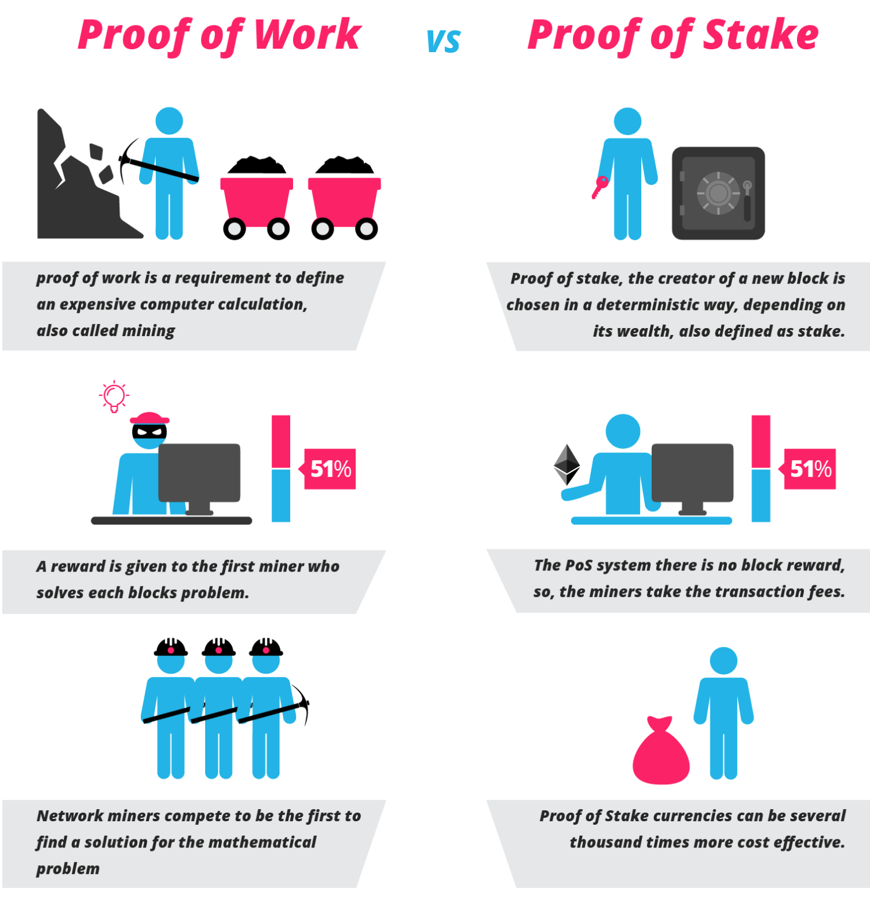

#### 本文摘自[亿书](http://bitcoin-on-nodejs.ebookchain.org/3-源码解读/2-入口程序app.js解读.html)

本文介绍一些 Node 可用的基本组件、相关代码，以及一些有关区块链的概念。

## Part 1. CODING PART

本部分介绍 Node 可用的基本组件、相关代码。

### Node 概述

#### 什么是 Node

> Node.js is a JavaScript runtime built on Chrome's V8 JavaScript engine. Node.js uses an event-driven, non-blocking I/O model that makes it lightweight and efficient.

Node.js 是一个搭建在 Chrome V8 上的 JavaScript 即时运行平台，采用事件驱动、非阻塞I/O模型，既轻量又高效。

#### Node 的优势在哪里：
* 模块化管理项目的能力，允许 js 代码分散在不通过的文件中。
* 也正是因为 js 代码可以分散，第三方包大量涌现，js 有了强大的后备支持。
* 开发完成后，Node 可以帮助开发者对前端代码的 js 或 css 等文件进行合并、压缩、混淆，以及项目部署等。

#### 开发者应该具备的 Node 思维

1、一切都是数据流
2、事事皆回调
3、异常要捕捉


### 安装使用CNpm：
使用淘宝npm镜像，可以提高我们的组件下载数度

```
npm install -g cnpm --registry=https://registry.npm.taobao.org
```

### 安装前端管理工具 bower：

```
cnpm install -g bower 
```

当然也可以使用 npm install * 命令，二者一样，只不过cnpm使用淘宝镜像，在中国安装会快些

bower 是一个 npm 包，它专门用来管理 web 前端（包含js,css,images,fonts等）依赖包。我们可以简单类比，bower 用于管理前端包，npm 管理后台库（包）。

### d3.js

```
bower install d3 --save
```

选项 --save 将在 bower.json 文件里，写入下面的信息：
```
"dependencies": {
  ...
  "d3": "^4.13.0"
  ...
}
```

于是，在另一台电脑开发时，克隆完代码，就可以直接运行下面的命令，**自动安装**全部依赖的第三方组件了

```
bower intall
```

和 npm 很像啊是不是～

d3.js 是**数据可视化**非常出名的前端开发包，提供前端可显示的柱状图、饼状图等。

### gulp

```
cnpm install gulp --global
# Then
cnpm install gulp --save-dev
```

所以，gulp 是干嘛的？

为了提高页面加载速度，增强用户体验，需要对代码进行合并、压缩，如果要保护自己的劳动，不想被别人无偿使用，还需要对代码进行混淆，最好部署到专门的服务器空间上去。这些工作，可以实现一键操作，这里切入了 gulp！

### 模版引擎

```
cnpm install ejs --save
```

ejs，它就像java的jsp，rails的rhtml，可以直接在html文件里嵌入代码，简单好用。
除了 ejs，还有 hbs 等。目前本喵就是用 hbs 模版配合 React 搭建公司的项目。

```
------- 其他 ejs 的相关代码 -------
app.set('views', './views')
app.set('view engine', 'ejs')

app.get('/', function (req, res) {
  res.render('index');
});
```

### 使用静态文件服务

```
app.use(express.static('./public', {
  maxAge: '0', //no cache
  etag: true
}));
```

上面的代码意思是，在 public 下的文件，包括 js, css, images, fonts等都当作静态文件处理，根路径是 ./public,请求地址就相对于/，比如：./public/js/app.js 文件，请求地址就是http://localhost:8080/js/app.js

>说明：这里有一个小问题，使用bower安装的前端第三方开发包，都在bower_components文件夹下，需要移到public文件夹里。同时需要添加一个.bowerrc文件，告诉bower组件安装目录改变了，并修改gulpfile.js文件。当然也可以连同bower.json文件都拷贝到public文件夹里。

### commander

commander 是 Node.js 第三方组件（使用 npm 安装），常被用来开发命令行工具，用法极为简单，Ebooker 源码：

```
// 1行: 引入
var program = require('commander');

// 19行
program
    .version(packageJson.version)
    .option('-c, --config <path>', 'Config file path')
    .option('-p, --port <port>', 'Listening port number')
    .option('-a, --address <ip>', 'Listening host name or ip')
    .option('-b, --blockchain <path>', 'Blockchain db path')
    .option('-x, --peers [peers...]', 'Peers list')
    .option('-l, --log <level>', 'Log level')
    .parse(process.argv);
```

这样，就可以在命令行执行命令时，加带 -c, -p 等选项，例如：

```
node app.js -p 8888
```

## Part 2. CONCEPTS OF BLOCKCHAIN

本部分介绍区块链相关的概念。

### 共识机制

共识机制可以被解释为：可编程的利益转移**规则**。借助共识机制（也就是某一套规则），加密货币有可能建立起一个“**无需监管的自适应经济系统**”。

共识机制包含各种激励制度和具体算法，比如：交易费用、区块奖励等。目前常用的有三种：PoW，PoS，DPoS。

#### PoW（Proof of Work）：工作量证明机制

原理非常简单，就是多劳多得：你付出多少劳动（劳动 = 计算服务 = 算力x时长），就会获得多少报酬（比特币等加密货币）

#### PoS（Proof of Stake）：股权证明机制。

PoW 中，全网矿工都会耗费 CPU/GPU 资源来计算一道题目争夺记账权；因此你的算力越强，得到记账权的概率也就越大。但其实这是非常浪费资源的，而且目前，为了能获取挖矿奖励，很多用户将算力集中成矿池、矿场来共同挖矿，这与去中心化的方向背道而驰。

而 PoS 则是另一机制，这一机制下不用挖矿，而是一个根据用户持有货币的多少和时间（币龄），发放利息。而创建新区块的权利则是根据用户持有的货币的多少和时间来选择决定的。



#### DPoS（Delegated Proof of Stake）：授权股权证明机制

>对于 PoS 机制的加密货币，每个节点都可以创建区块，并按照个人的持股比例获得“利息”。而 DPoS 是由被社区选举的可信帐户（受托人，得票数排行前101位）来创建区块。为了成为正式受托人，用户要去社区拉票，获得足够多用户的信任。用户根据自己持有的加密货币数量占总量的百分比来投票。DPoS机制类似于股份制公司，普通股民进不了董事会，要投票选举代表（受托人）代他们做决策。

目前，DPoS 机制是最安全环保、运转高效的共识机制。

## Part 3. SHARE

[深度|在这里读懂比特币与区块链！十万言《比特币无罪》系列重磅开放首章万字文。](https://mp.weixin.qq.com/s/EuwqlE4611Tsfj2f7RpKwQ)


